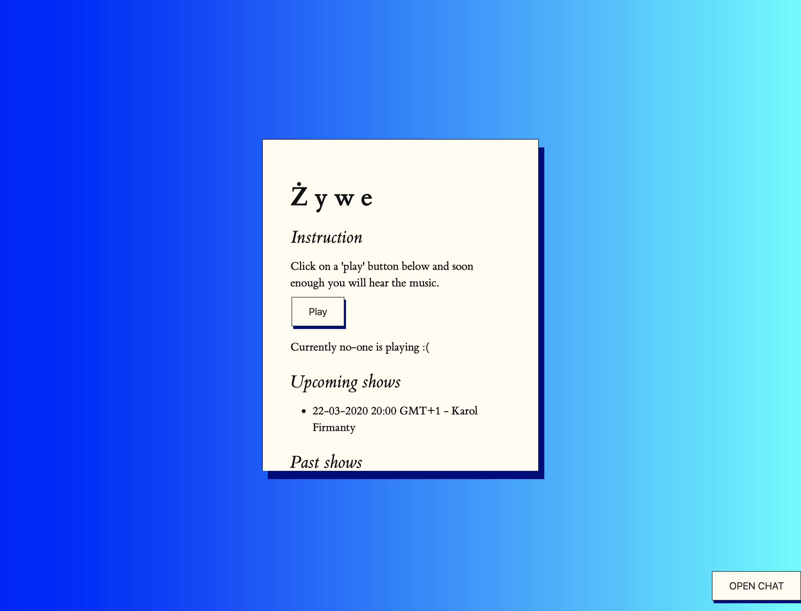

# Żywe Radio web page

Repository for web page of "Żywe Radio" focused on streaming live music. Technologies used are really simple so anyone can fork it with ease and create their own radio station - there is no need to setup fancy database etc. just icecast, web server like apache2.

## If you want to set up your own radio
1) Install icecast on server: `sudo apt install icecast2`. You will be asked to create few passwords - remember them.
2) Install webserver to host this page. If you choose apache2 install it using following command `sudo apt install apache2` then copy this page files to `/var/www/html/`.
3) Edit `index.html` and replace `firmanty.com` with your own hostname (or server IP number). The same with upcoming and incoming shows section :)
4) Test that stream works correctly by using following tool (http://danielnoethen.de/butt/) (warning: if you are using MacOS at the time of writting version `0.1.19` doesn't work on Mac - use `0.1.18`).
- After installation click settings and `Add` in `Server` section. Fill the host data with your own - password is password for the user `source` that was created during installation. Mountpoint can be anything but if you want to use following page without modifying it then set it as `/radio`. Icecast user will be `/radio`.
- In the `Audio` tab select your input device and set streaming coded to `mp3`.
- Save config and test the connection by clicking `play` button.
- You should see `Connection established` message, after that click `record` and now anyone that will visit your page and click `Play` will hear your stream :)
